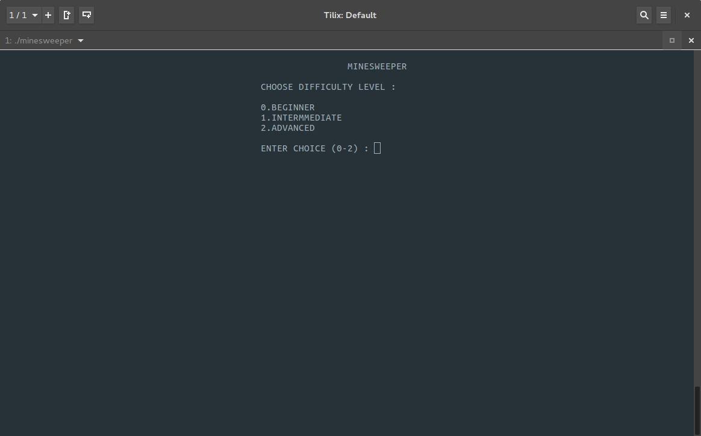
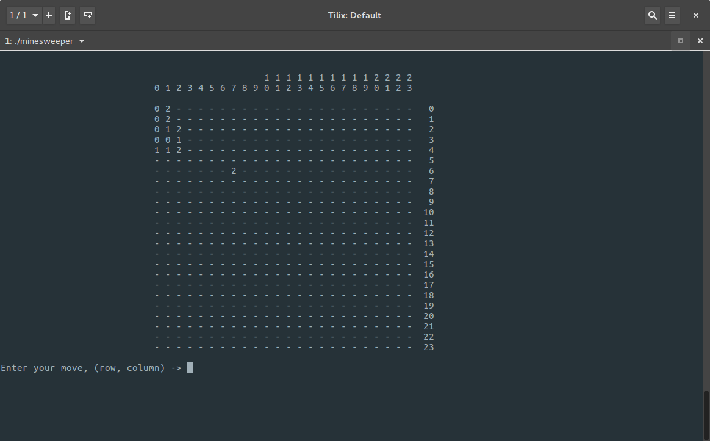

# Minesweeper

Minesweeper in c++
LANGUAGE USED: C++


HEADER FILES: bits/stdc++.h and random.h
Uses modularity and random function to generate mines according to the level chosen


## How to run

```
g++ minesweeper.cpp -o minesweeper
./minesweeper
```


## How to play

### Choose a difficulty



### Play the game!




